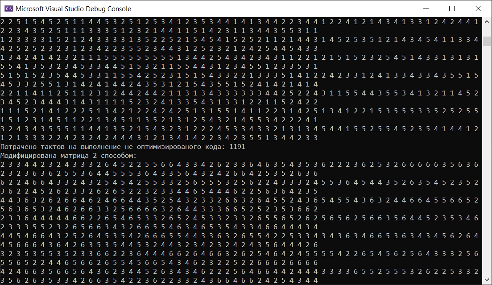

# OSLab5  Оптимізація роботи з пам'яттю
Ціль даної л.р.:
1)	Проаналізувати програму, виміряти час її виконання.
2)	Виходячи з описаних у теорії механізмів організації пам'яті внести необхідні зміни в структуру коду.
3)	Виміряти новий час виконання, за наявності очевидних поліпшень, переходити до п.4, якщо немає - до п.1
4)	Зафіксувати нові показники і пояснити, за рахунок чого було досягнуто прискорення.

В цілому, приміняються наступні техніки:
•	Увагуа на внутрішніх циклах. Саме там відбувається найбільший обсяг обчислень і звернень до пам'яті.
•	Максимізувати просторову локальність, зчитуючи об'єкти з пам'яті послідовно, у тому порядку, в якому вони у ній розташовані.
•	Максимізувати часову локальність, використовуючи об'єкти даних якомога частіше після того, як вони були прочитані з пам'яті.

## Початковий код(неоптимізований)

## Кінцевий код(оптимізований)

Обидві функції виконують одну і ту ж кількість інструкцій процесора. Але другий код, оптимізований, виконується трішки швидше. Зміни незначні, але цей спосіб зробить час виконання вашого коду швидшим, особливо для великого об'єму даних. 
